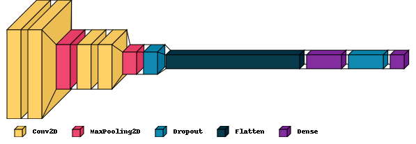

## 🧩🤖 CNN (Convolutional Neural Network) Implementation

This project takes an **unsolved Sudoku image**, uses a **Convolutional Neural Network (CNN)** to recognize digits, and then solves the puzzle with a **backtracking algorithm**.  
It combines **deep learning (CNN)** for digit recognition with **algorithmic Sudoku solving**.

---

## ✨ Features

- Recognizes digits in Sudoku images using a trained CNN model.
- Automatically solves the puzzle with backtracking.
- Displays both unsolved and solved Sudoku grids.
- More robust against image noise compared to OCR-only solutions.

---

## Model Image



---

## 📦 Requirements

- Python 3.x
- TensorFlow / Keras
- OpenCV
- NumPy

Install dependencies with:

```bash
pip install -r requirements.txt
```
