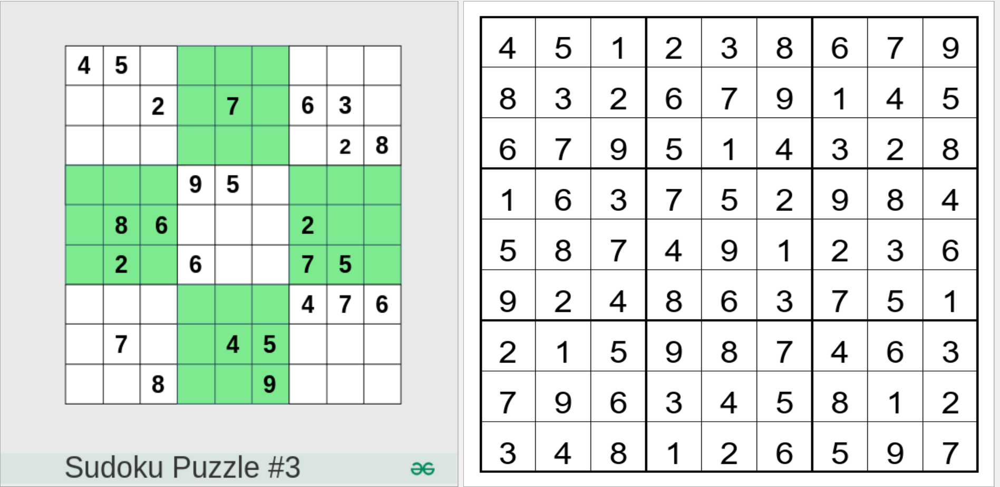
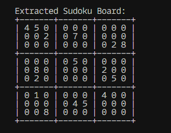
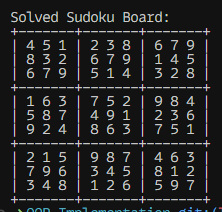

<h1 align="center" >GridVision</h1>

<p align="center">
  
  
  
  <a href="https://medium.com/@ahmedyar7/from-pixels-to-solutions-an-intelligent-sudoku-solver-ddefe5709ca6" target="_blank">
    
 </a>
</p>

An intelligent Sudoku solver that combines **Computer Vision**, **Optical Character Recognition (OCR)**, **Deep Learning (CNN)**, and **Recursive Backtracking (C++)** to solve Sudoku puzzles directly from images.

This project demonstrates how classical **Data Structures & Algorithms (DSA)** can be blended with **modern AI techniques** to create robust and efficient systems.

---

## 🚀 Features

- 📸 Extract Sudoku puzzle from an image using **OpenCV**
- 🔍 Recognize digits using **EasyOCR**
- 🧮 Solve Sudoku efficiently with **Recursive Backtracking (C++ implementation)**
- 🤖 Alternative digit recognition using **Convolutional Neural Network (CNN)**
- 🖥️ CLI output and simple **GUI interface**
- ⚡ Hybrid pipeline combining **traditional algorithms + deep learning**

---

## Example Output:



<table>
    <caption>Sudoku Project Visuals</caption>
    <tr>
      <td>
        <div class="square">
          
        </div>
      </td>
      <td>
        <div class="square">
          
        </div>
      </td>
    </tr>
  </table>

## 📂 Project Structure

```
E
├── OCR-Implementation
│   ├── gui.py              # GUI interface for Sudoku solver
│   ├── img\_processing.py   # Image preprocessing & grid extraction
│   ├── main.py             # Entry point for OCR + solver pipeline
│   ├── ocr\_utils.py        # OCR utilities (digit extraction, 2D board creation)
│   ├── solver.py           # Python wrapper to call C++ solver
│   ├── utils.py            # Helper functions
│
├── Helper/sudoku_solver.cpp       # C++ recursive backtracking solver
└── README.md

```

---

## ⚙️ How It Works

1. **Image Preprocessing**

   - Convert to grayscale
   - Apply thresholding
   - Detect contours & warp perspective to get a clean Sudoku grid

2. **Digit Extraction (OCR / CNN)**

   - `EasyOCR` is used to recognize digits from each cell
   - CNN model can be used for improved recognition accuracy

3. **Board Creation**

   - Digits are arranged into a **9x9 2D array**
   - Empty cells are represented as `0`

4. **Solving**
   - Board is passed to a **C++ backtracking solver** for fast computation
   - Output is displayed via **CLI** or **GUI**

---

## 🖼️ Example Workflow

- Input: Raw Sudoku image
- Preprocessing: Grid extraction + thresholding
- OCR/CNN: Digit recognition
- Solver: C++ backtracking
- Output: Solved Sudoku (CLI or GUI view)

---

## Tech Stack:

<div align="center">

  
  
  
  
  
  
  
  
  
  
  
  

</div>

## 🔧 Installation & Setup

1. Clone the repository:

   ```bash
   git clone https://github.com/ahmedyar7/GridVision.git
   cd GridVision
   ```

2. Install Python dependencies:

   ```bash
   pip install -r requirements.txt
   ```

3. Compile the C++ solver:

   ```bash
   g++ sudoku_solver.cpp -o sudoku_solver
   ```

4. Run the OCR pipeline:

   ```bash
    python .\OCR-Implementation\main.py
   ```

---

## 📚 Tech Stack

- **Python**: OpenCV, EasyOCR, NumPy
- **C++**: Recursive Backtracking for solving
- **Deep Learning**: CNN model for digit recognition
- **GUI**: Python (Tkinter / PyQt based, depending on your version)

---

## 🎯 Future Improvements

- Real-time Sudoku solving from camera feed
- Mobile app integration
- More robust CNN training with larger datasets
- Cloud API for solving uploaded puzzles

---

## 📝 License

This project is licensed under the [MIT](./LICENSE) License — feel free to use and modify.

---

## 🙌 Acknowledgments

- [OpenCV](https://opencv.org/) for image preprocessing
- [EasyOCR](https://github.com/JaidedAI/EasyOCR) for digit recognition
- [GeeksforGeeks](https://www.geeksforgeeks.org/) for Sudoku references
